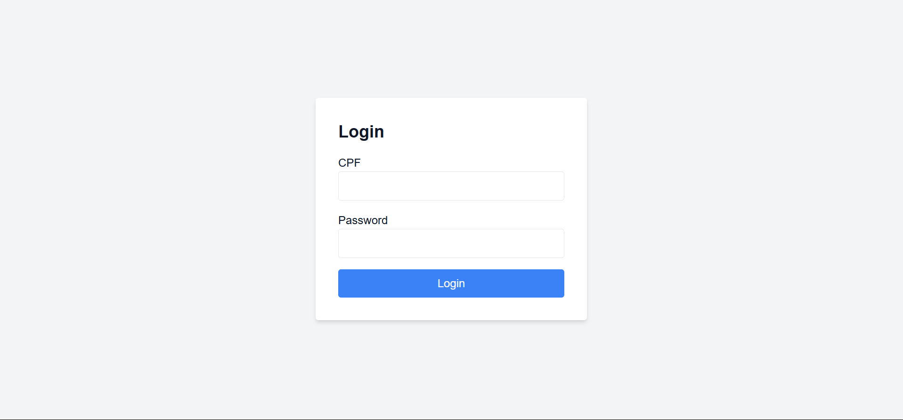
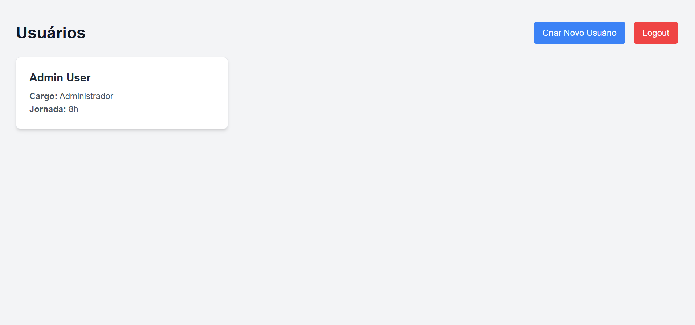
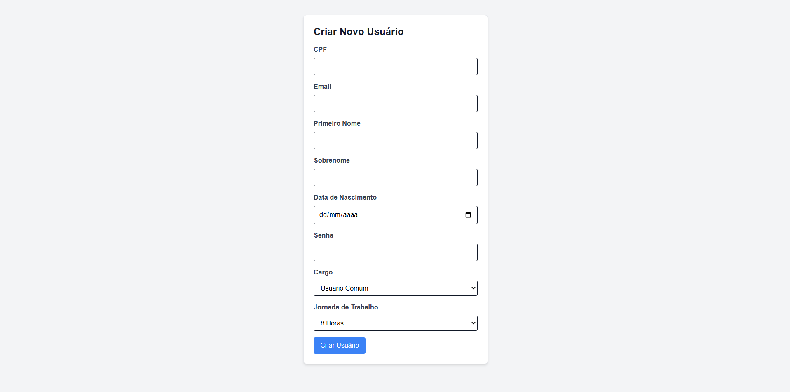
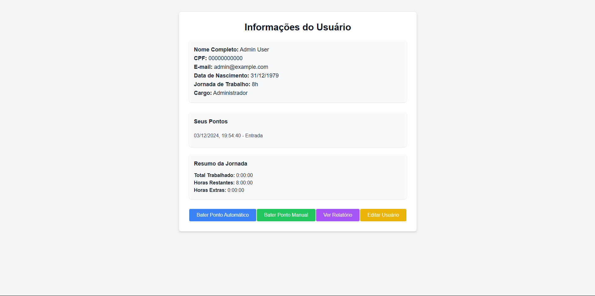
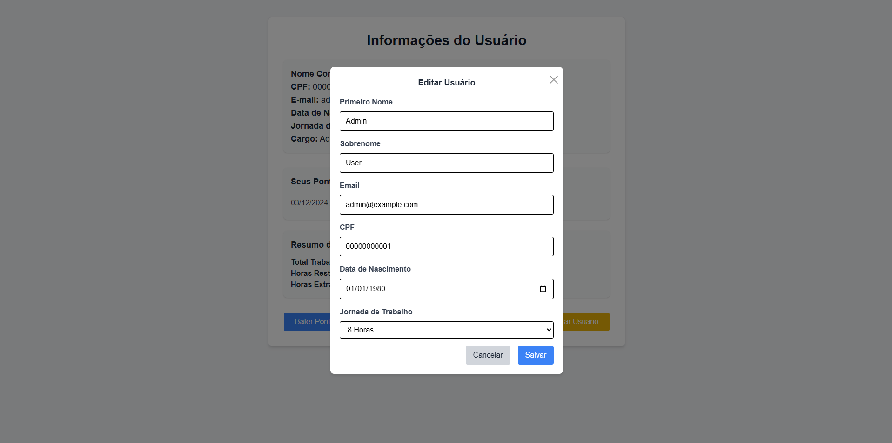
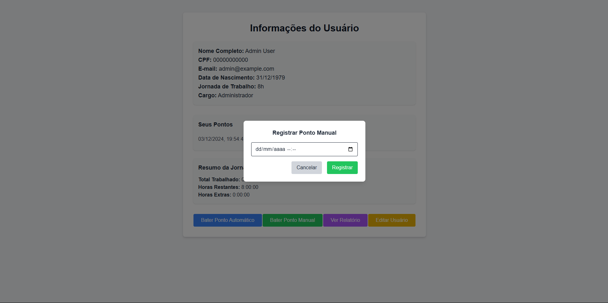
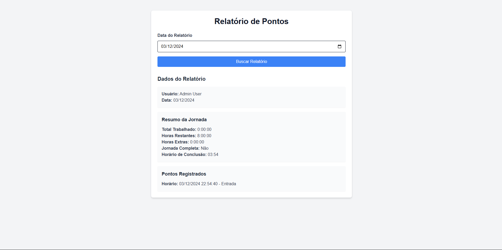

## **Descrição**

Este projeto consiste em um sistema com backend baseado em Django Rest Framework e frontend construído com Next.js. Ele utiliza Docker para simplificar a configuração e execução.

## Índice

- [Documentação da API](idus-backend/README.md)

## **Requisitos**

- **Docker** e **Docker Compose** instalados na máquina.

## **Como Rodar o Projeto**

1. **Clone o Repositório**  
   Clone este repositório na sua máquina local:

   ```bash
   git clone https://github.com/phelukas/idus-project.git
   cd idus-project
   ```

2. **Suba os Serviços com Docker Compose**  
   Execute o seguinte comando:

   ```bash
   docker-compose up --build
   ```

   Isso irá:

   - Construir as imagens Docker.
   - Iniciar os containers para o backend, frontend e banco de dados.

3. **Acesse o Sistema**
   - **Frontend**: [http://localhost/](http://localhost:3000/)
   - **Backend API**: [http://localhost/api/](http://localhost:8000/api/)

## **Estrutura de Serviços**

- **Backend**: Django Rest Framework rodando em `http://localhost:8000/api/`
- **Frontend**: Next.js rodando em `http://localhost:3000/`
- **Banco de Dados**: PostgreSQL gerenciado em um container Docker.

## **Como Personalizar**

Se precisar ajustar alguma configuração, como variáveis de ambiente, edite o arquivo `.env` localizado na raiz do projeto. Exemplo:

```env
SECRET_KEY=django-insecure-f55x+z^!6gcz52*w7%o7n5vt58ghciv#9@2epuk=)ug*##rcac
DEBUG=True
DATABASE_NAME=idusdb
DATABASE_USER=idususer
DATABASE_PASSWORD=iduspass
DATABASE_HOST=db
DATABASE_PORT=5432
CORS_ALLOWED_ORIGINS=http://localhost,http://127.0.0.1:3000
```

## **Telas**

**Login**



**Dashboard**



**Criação de usuario**



**Informaçõe sobre usuario**



**Edição de usuario**



**Tela de ponto manual**



**Relatorio de pontos**


