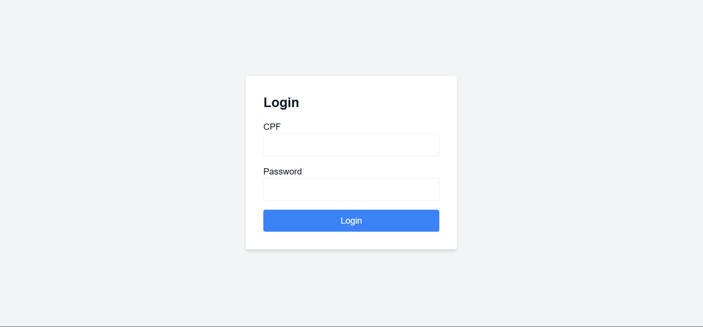
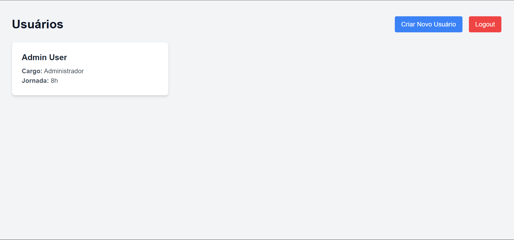
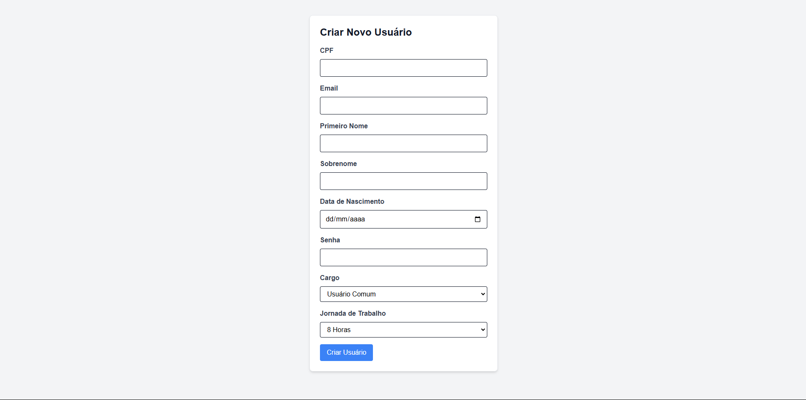
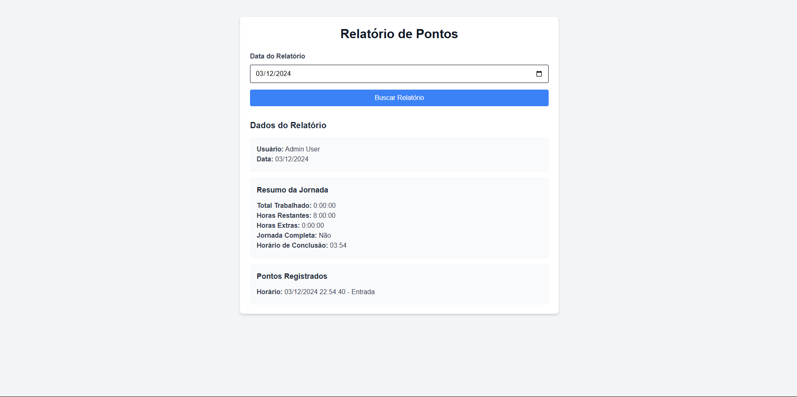

# IDUS — gestão de jornada de trabalho

[](https://github.com/phelukas/idus-project/actions/workflows/ci.yml)

Aplicação full stack para cadastro de colaboradores, autenticação por CPF, registro de pontos com localização e geração de relatórios de jornada.

O projeto demonstra a integração entre uma API REST em Django e uma interface em Next.js, com persistência em PostgreSQL e ambiente local reproduzível com Docker Compose.

## Principais funcionalidades

- autenticação com JWT e controle de acesso;
- cadastro e manutenção de colaboradores;
- registro manual de pontos com data, horário e geolocalização;
- cálculo e visualização do resumo diário da jornada;
- consulta e impressão de relatórios;
- documentação interativa da API com OpenAPI/Swagger.

## Stack

| Camada | Tecnologias |
| --- | --- |
| Backend | Python 3.12, Django, Django REST Framework, Simple JWT |
| Frontend | Next.js 15, React 19, Tailwind CSS |
| Dados | PostgreSQL 15 |
| Qualidade | Pytest, Jest, React Testing Library, Black, GitHub Actions |
| Infraestrutura | Docker e Docker Compose |

## Arquitetura

```text
Browser (Next.js :3000)
          |
          | HTTP/JSON + Bearer token
          v
Django REST API (:8000) ----> PostgreSQL (:5432)
```

O backend está dividido nos domínios `users` e `workpoints`. O frontend centraliza o acesso à API e mantém as páginas e componentes de cada fluxo. Em testes, o backend usa SQLite em memória para oferecer execução rápida e isolada; a aplicação usa PostgreSQL.

## Executar localmente

Pré-requisito: Docker Desktop com Docker Compose.

```bash
git clone https://github.com/phelukas/idus-project.git
cd idus-project
cp .env.example .env
```

Gere uma chave exclusiva e preencha `SECRET_KEY` no arquivo `.env`. Uma opção é:

```bash
python -c "import secrets; print(secrets.token_urlsafe(50))"
```

Depois, inicie os serviços:

```bash
docker compose up --build
```

Quando os contêineres estiverem prontos:

- aplicação web: http://localhost:3000
- API: http://localhost:8000/api/
- documentação OpenAPI: http://localhost:8000/api/docs/

Para encerrar, execute `docker compose down`.

## Testes e qualidade

O GitHub Actions executa testes e lint do backend e do frontend em cada pull request para `master`.

Backend:

```bash
cd idus-backend
python -m pip install -r requirements.txt
pytest
black --check .
```

Frontend:

```bash
cd idus-frontend
npm ci
npm test -- --runInBand
npm run lint
```

## Decisões e limitações atuais

- JWT foi escolhido para manter a API independente da sessão do navegador.
- O CPF é usado como identificador de login por refletir o domínio original do projeto.
- O ambiente Docker usa o servidor de desenvolvimento do Django; uma implantação produtiva deve usar um servidor WSGI/ASGI, HTTPS e cookies seguros.
- As credenciais padrão do banco existem apenas para desenvolvimento local e devem ser substituídas fora desse ambiente.
- A cobertura de testes ainda é parcial e deve crescer principalmente nos fluxos de autenticação, permissões e cálculo de jornada.

## Telas

| Login | Dashboard |
| --- | --- |
|  |  |

| Cadastro de colaborador | Relatório de pontos |
| --- | --- |
|  |  |

Mais detalhes sobre endpoints, modelos e autenticação estão na [documentação do backend](idus-backend/README.md).

## Licença

Distribuído sob a [licença MIT](LICENSE).
