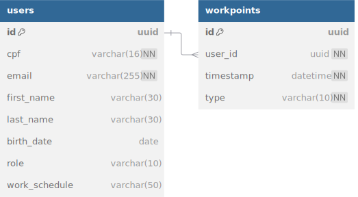

# Idus Backend

Este é o backend do projeto **Idus**, construído com Django e Django REST Framework. Ele fornece funcionalidades de gerenciamento de usuários, autenticação JWT, e operações relacionadas a pontos de trabalho.

## Índice

- [Requisitos](#requisitos)
- [Instalação](#instalação)
- [Configuração](#configuração)
- [Execução](#execução)
- [APIs Disponíveis](#apis-disponíveis)
- [Estrutura do Projeto](#estrutura-do-projeto)
- [Variáveis de Ambiente](#variáveis-de-ambiente)
- [Testes](#testes)

## Requisitos

Antes de começar, você precisará ter as seguintes ferramentas instaladas:

- [Python 3.10+](https://www.python.org/)
- [PostgreSQL](https://www.postgresql.org/)
- [Git](https://git-scm.com/)
- [pipenv](https://pipenv.pypa.io/)

## Instalação

1. Clone o repositório:

   ```bash
   git clone https://github.com/seu-usuario/seu-repositorio.git
   cd seu-repositorio
   ```

2. Crie um ambiente virtual:

   ```bash
   python -m venv venv
   ```

3. Ative o ambiente virtual:

   - **Linux/MacOS:**
     ```bash
     source venv/bin/activate
     ```
   - **Windows:**
     ```bash
     venv\Scripts\activate
     ```

4. Instale as dependências:
   ```bash
   pip install -r requirements.txt
   ```

## Configuração

1. Crie um arquivo `.env` na raiz do projeto e adicione as seguintes variáveis:

   ```env
   SECRET_KEY=seu-segredo
   DEBUG=True
   DATABASE_NAME=nome-do-banco
   DATABASE_USER=usuario
   DATABASE_PASSWORD=senha
   DATABASE_HOST=localhost
   DATABASE_PORT=5432
   ALLOWED_HOSTS=localhost,127.0.0.1
   CORS_ALLOWED_ORIGINS=http://localhost:3000
   ACCESS_TOKEN_LIFETIME=60
   ```

2. Altere o banco de dados, se necessário, para produção ou desenvolvimento.

3. Aplique as migrações:
   ```bash
   python manage.py migrate
   ```

## Execução

1. Inicie o servidor de desenvolvimento:

   ```bash
   python manage.py runserver
   ```

2. O backend estará acessível em:

   ```
   http://127.0.0.1:8000
   ```

3. **Criação de Superusuário Padrão:**

   - Ao executar `python manage.py migrate`, um superusuário com CPF `39416362000` é criado automaticamente, com o seguinte login:
     ```plaintext
     CPF: 39416362000
     Senha: admin123
     ```

## APIs Disponíveis

### Exemplos de Requisições Disponíveis na API

#### **1. Autenticação**

##### **1.1. Obter Token JWT**

- **Endpoint:** `POST /auth/jwt/create/`
- **Corpo da Requisição (JSON):**
  ```json
  {
    "cpf": "39416362000",
    "password": "admin123"
  }
  ```
- **Resposta (Exemplo):**
  ```json
  {
    "access": "eyJ0eXAiOiJKV1QiLC...",
    "refresh": "eyJ0eXAiOiJKV1QiLC..."
  }
  ```

##### **1.2. Atualizar Token de Acesso**

- **Endpoint:** `POST /auth/jwt/refresh/`
- **Corpo da Requisição (JSON):**
  ```json
  {
    "refresh": "eyJ0eXAiOiJKV1QiLC..."
  }
  ```
- **Resposta (Exemplo):**
  ```json
  {
    "access": "eyJ0eXAiOiJKV1QiLC..."
  }
  ```

---

#### **2. Gerenciamento de Usuários**

##### **2.1. Criar Usuário**

- **Endpoint:** `POST /users/create/`
- **Autenticação:** Necessária (Token JWT)
- **Corpo da Requisição (JSON):**
  ```json
  {
    "cpf": "12345678900",
    "email": "usuario@example.com",
    "first_name": "Usuário",
    "last_name": "Exemplo",
    "birth_date": "1990-01-01",
    "password": "senha123",
    "role": "common",
    "work_schedule": "8h"
  }
  ```
- **Resposta (Exemplo):**
  ```json
  {
    "detail": "Usuário criado com sucesso.",
    "data": {
      "id": "b9f8b5d2-45b3-4512-8c6f-23c0e99f1a57",
      "cpf": "12345678900",
      "email": "usuario@example.com",
      "first_name": "Usuário",
      "last_name": "Exemplo",
      "birth_date": "1990-01-01",
      "role": "common",
      "work_schedule": "8h"
    }
  }
  ```

##### **2.2. Listar Usuários**

- **Endpoint:** `GET /users/list/`
- **Autenticação:** Necessária (Token JWT)
- **Resposta (Exemplo para Administradores):**
  ```json
  {
    "detail": "Dados retornados com sucesso.",
    "data": [
      {
        "id": "b9f8b5d2-45b3-4512-8c6f-23c0e99f1a57",
        "cpf": "12345678900",
        "email": "usuario@example.com",
        "first_name": "Usuário",
        "last_name": "Exemplo",
        "birth_date": "1990-01-01",
        "role": "common",
        "work_schedule": "8h"
      }
    ]
  }
  ```

##### **2.3. Obter Informações de Usuário**

- **Endpoint:** `GET /users/info/`
- **Autenticação:** Necessária (Token JWT)
- **Resposta (Exemplo):**
  ```json
  {
    "id": "b9f8b5d2-45b3-4512-8c6f-23c0e99f1a57",
    "cpf": "12345678900",
    "email": "usuario@example.com",
    "first_name": "Usuário",
    "last_name": "Exemplo",
    "birth_date": "1990-01-01",
    "role": "common",
    "work_schedule": "8h"
  }
  ```

##### **2.4. Atualizar Usuário**

- **Endpoint:** `PATCH /users/update/<uuid:id>/`
- **Autenticação:** Necessária (Token JWT)
- **Corpo da Requisição (JSON):**
  ```json
  {
    "first_name": "Usuário Atualizado"
  }
  ```
- **Resposta (Exemplo):**
  ```json
  {
    "detail": "Usuário atualizado com sucesso.",
    "data": {
      "id": "b9f8b5d2-45b3-4512-8c6f-23c0e99f1a57",
      "cpf": "12345678900",
      "email": "usuario@example.com",
      "first_name": "Usuário Atualizado",
      "last_name": "Exemplo",
      "birth_date": "1990-01-01",
      "role": "common",
      "work_schedule": "8h"
    }
  }
  ```

##### **2.5. Deletar Usuário**

- **Endpoint:** `DELETE /users/delete/<uuid:id>/`
- **Autenticação:** Necessária (Token JWT)
- **Resposta (Exemplo):**
  ```json
  {
    "detail": "Usuário deletado com sucesso."
  }
  ```

---

#### **Pontos de Trabalho (Workpoints)**

##### **3.1. Registrar Ponto**

- **Endpoint:** `POST /workpoints/<id>/register-point/`
- **Autenticação:** Necessária (Token JWT)
- **Corpo da Requisição (JSON):**
  ```json
  {
    "timestamp": "2024-01-01T12:00:00Z"
  }
  ```
- **Resposta (Exemplo):**
  ```json
  {
    "detail": "Ponto registrado com sucesso."
  }
  ```

##### **3.2. Relatório de Pontos**

- **Endpoint:** `GET /workpoints/report/<id>/`
- **Autenticação:** Necessária (Token JWT)
- **Resposta (Exemplo):**
  ```json
  {
    "data": [
      {
        "timestamp": "2024-01-01T12:00:00Z",
        "status": "Entrada"
      },
      {
        "timestamp": "2024-01-01T18:00:00Z",
        "status": "Saída"
      }
    ]
  }
  ```

---

### Documentação Completa da API

A documentação completa da API, gerada automaticamente pelo **DRF Spectacular**, está disponível no Swagger UI. Acesse no link abaixo:

- [Documentação Swagger](http://127.0.0.1:8000/api/docs/)

---

### **Resumo dos Endpoints**

| Método | Endpoint                           | Descrição                               |
| ------ | ---------------------------------- | --------------------------------------- |
| POST   | `/auth/jwt/create/`                | Gerar token JWT                         |
| POST   | `/auth/jwt/refresh/`               | Atualizar token JWT                     |
| POST   | `/users/create/`                   | Criar novo usuário                      |
| GET    | `/users/list/`                     | Listar usuários                         |
| GET    | `/users/info/`                     | Obter informações do usuário logado     |
| GET    | `/users/info/<uuid:id>/`           | Obter informações de usuário específico |
| PATCH  | `/users/update/<uuid:id>/`         | Atualizar dados do usuário              |
| DELETE | `/users/delete/<uuid:id>/`         | Deletar usuário                         |
| POST   | `/workpoints/<id>/register-point/` | Registrar ponto de trabalho             |
| GET    | `/workpoints/report/<id>/`         | Obter relatório de pontos de trabalho   |

## Testes

1. Para rodar os testes automatizados:

   ```bash
   python manage.py test
   ```

2. Certifique-se de criar os casos de teste em:
   ```
   app_name/tests.py
   ```

## Descrição dos Arquivos

### Arquivos Gerais

- **README.md**: Documentação do projeto, incluindo estrutura e explicação de funcionalidades.
- **manage.py**: Script principal para gerenciar o projeto Django (migrações, servidor de desenvolvimento, etc.).
- **pytest.ini**: Configuração para rodar testes com Pytest.
- **requirements.txt**: Lista de dependências do projeto.

### Diretório `idus_backend`

- ****init**.py**: Marca este diretório como um pacote Python.
- **asgi.py**: Configuração para o servidor ASGI, necessário para deploys com suporte a WebSockets e outras tecnologias assíncronas.
- **settings.py**: Configurações principais do projeto Django (banco de dados, aplicativos instalados, etc.).
- **urls.py**: Define as rotas globais do projeto.
- **wsgi.py**: Configuração para o servidor WSGI, usado em deploys tradicionais.

### Diretório `users`

- ****init**.py**: Marca este diretório como um pacote Python.
- **admin.py**: Configuração para integrar os modelos à interface administrativa do Django.
- **apps.py**: Configuração do aplicativo `users` dentro do projeto.
- **backends.py**: Contém customizações de autenticação ou lógica relacionada a backends.
- **migrations/**: Arquivos gerados automaticamente para aplicar alterações no banco de dados.
- **models.py**: Define as classes do modelo de dados para `users`.
- **serializers.py**: Define como os modelos são convertidos para JSON e vice-versa.
- **signals.py**: Contém sinais Django usados para eventos como criação ou atualização de objetos.
- **tests.py**: Contém testes unitários para garantir a qualidade do aplicativo `users`.
- **urls.py**: Rotas específicas do aplicativo `users`.
- **views.py**: Lida com a lógica de requisições e respostas para `users`.

### Diretório `workpoints`

- ****init**.py**: Marca este diretório como um pacote Python.
- **admin.py**: Configuração para integrar os modelos à interface administrativa do Django.
- **apps.py**: Configuração do aplicativo `workpoints` dentro do projeto.
- **migrations/**: Arquivos gerados automaticamente para aplicar alterações no banco de dados.
- **models.py**: Define as classes do modelo de dados para `workpoints`.
- **serializers.py**: Define como os modelos são convertidos para JSON e vice-versa.
- **tests.py**: Contém testes unitários para garantir a qualidade do aplicativo `workpoints`.
- **urls.py**: Rotas específicas do aplicativo `workpoints`.
- **utils.py**: Contém funções utilitárias usadas pelo aplicativo `workpoints`.
- **views.py**: Lida com a lógica de requisições e respostas para `workpoints`.


## Diagrama de Entidade/Relacionamento (DER)

O diagrama abaixo reflete a arquitetura de dados aplicada ao projeto:



